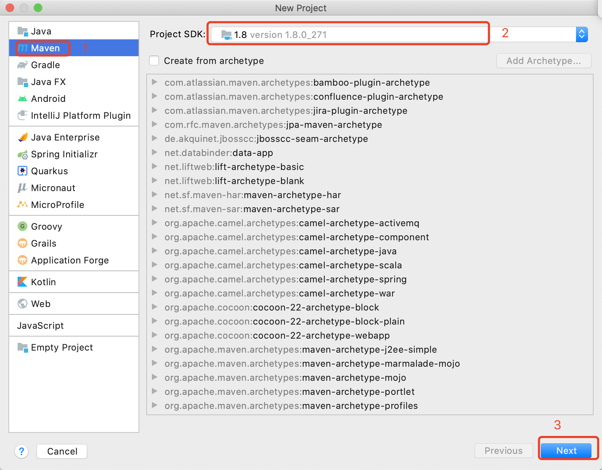
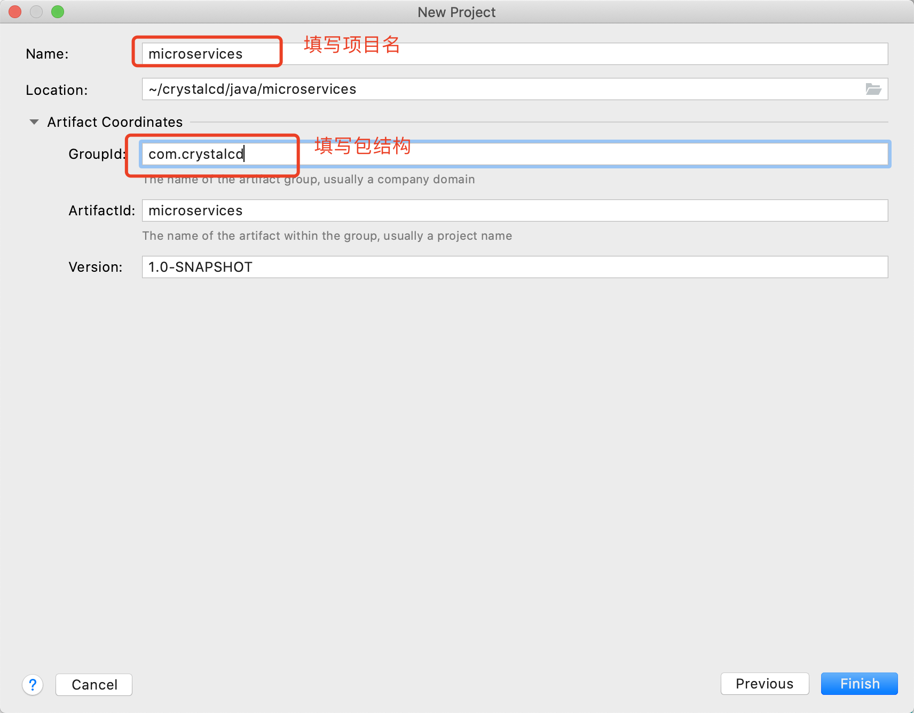
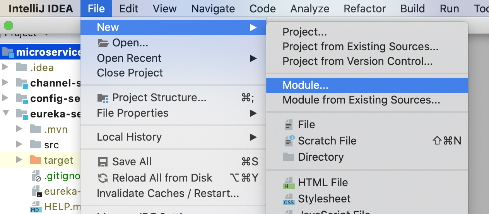
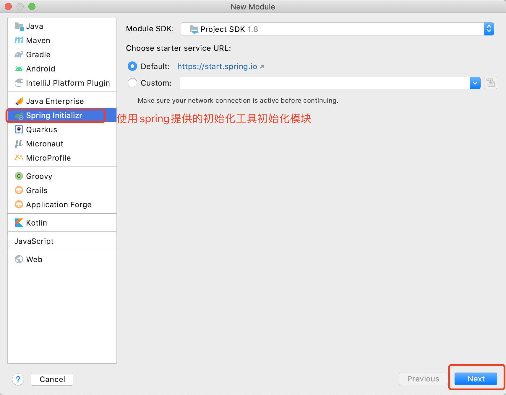
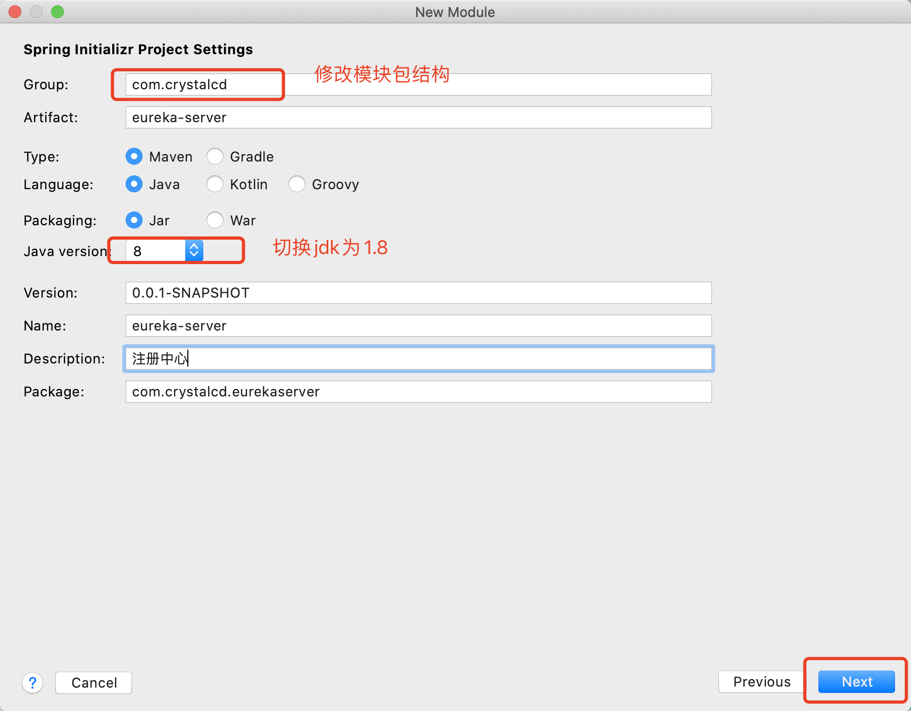
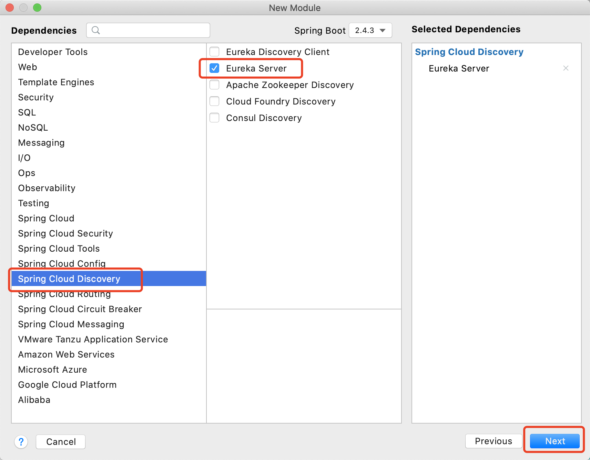
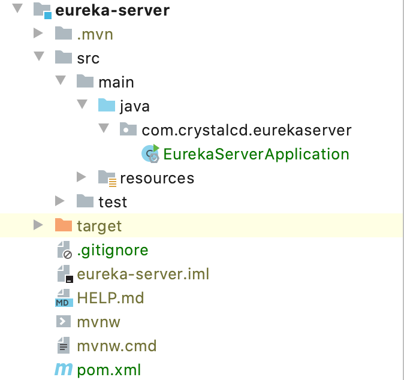
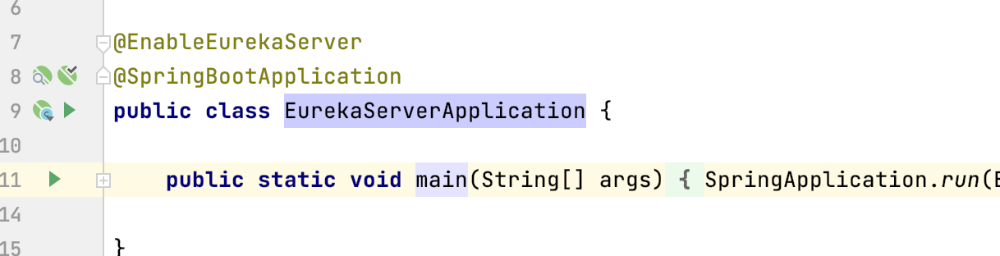
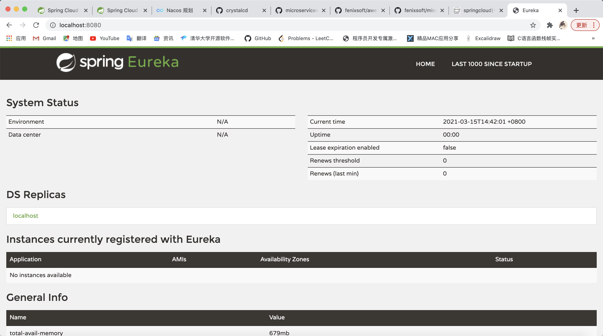

## 准备
1. jdk1.8
2. maven

## 创建项目

1. 打开idea，点击File->New->Project，按照下图操作

   

   

   点击Finish完成项目创建。

2. 删除项目下的src目录。

## 添加模块

1. 选中项目，点击File->New->Module。

   

### 官方构建工具


1. 

2. 

3. 

4. 构建完成，文件路径如下。

   

### maven模块

1. 创建maven模块，拷贝以下配置替换pom.xml的内容。

   ```
   <?xml version="1.0" encoding="UTF-8"?>
   <project xmlns="http://maven.apache.org/POM/4.0.0" xmlns:xsi="http://www.w3.org/2001/XMLSchema-instance"
            xsi:schemaLocation="http://maven.apache.org/POM/4.0.0 https://maven.apache.org/xsd/maven-4.0.0.xsd">
       <modelVersion>4.0.0</modelVersion>
       <parent>
           <groupId>org.springframework.boot</groupId>
           <artifactId>spring-boot-starter-parent</artifactId>
           <version>2.4.3</version>
           <relativePath/> <!-- lookup parent from repository -->
       </parent>
       <groupId>com.crystalcd</groupId>
       <artifactId>eureka-server</artifactId>
       <version>0.0.1-SNAPSHOT</version>
       <name>eureka-server</name>
       <description>注册中心</description>
       <properties>
           <java.version>1.8</java.version>
           <spring-cloud.version>2020.0.1</spring-cloud.version>
       </properties>
       <dependencies>
           <dependency>
               <groupId>org.springframework.cloud</groupId>
               <artifactId>spring-cloud-starter-netflix-eureka-server</artifactId>
           </dependency>
   
           <dependency>
               <groupId>org.springframework.boot</groupId>
               <artifactId>spring-boot-starter-test</artifactId>
               <scope>test</scope>
           </dependency>
       </dependencies>
       <dependencyManagement>
           <dependencies>
               <dependency>
                   <groupId>org.springframework.cloud</groupId>
                   <artifactId>spring-cloud-dependencies</artifactId>
                   <version>${spring-cloud.version}</version>
                   <type>pom</type>
                   <scope>import</scope>
               </dependency>
           </dependencies>
       </dependencyManagement>
   
       <build>
           <plugins>
               <plugin>
                   <groupId>org.springframework.boot</groupId>
                   <artifactId>spring-boot-maven-plugin</artifactId>
               </plugin>
           </plugins>
       </build>
   
   </project>
   
   ```

2. 在src下创建com.crystalcd.eurekaserver.EurekaServerApplication.java这个文件，拷贝以下代码到该文件。

   ```
   package com.crystalcd.eurekaserver;
   
   import org.springframework.boot.SpringApplication;
   import org.springframework.boot.autoconfigure.SpringBootApplication;
   import org.springframework.cloud.netflix.eureka.server.EnableEurekaServer;
   
   @SpringBootApplication
   public class EurekaServerApplication {
   
       public static void main(String[] args) {
           SpringApplication.run(EurekaServerApplication.class, args);
       }
   
   }
   
   ```

   

## 启动

1. 打开EurekaServerApplication.java文件，添加`@EnableEurekaServer`注解。

   

2. 点击运行按钮，等待启动完成访问[localhost:8080](http://localhost:8080/)，看到以下界面则创建成功。

   

